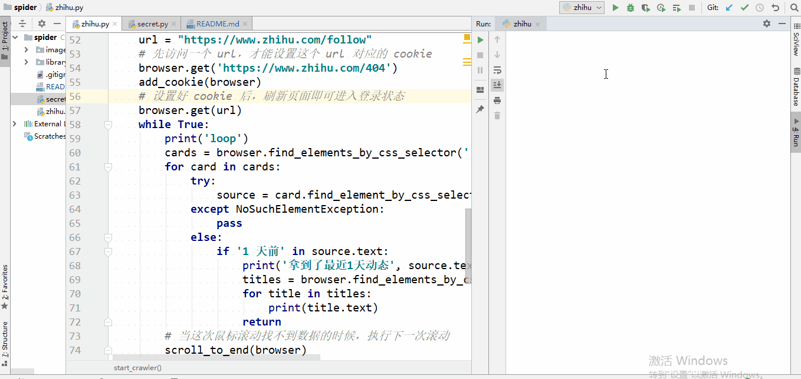

爬取知乎关注
================================
## 简介
* 基于Python的Selenium库和无头浏览器技术，动态爬取知乎关注用户的回答
* 设置cookie实现模拟登录，利用Selenium库调用JavaScript的API实现鼠标滚动，从而更新页面进行动态爬取
* 利用css选择器在拿到的页面数据中筛选目标内容

## 依赖
* Windows 10

* Python 3.6

* chromedriver.exe

## 运行部署
* 需要在本地根目录下添加`secret.py` ，内容格式为：
```
cookie = '登录知乎的Request Headers中的cookie字段'
```

## 详细演示

